

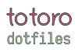

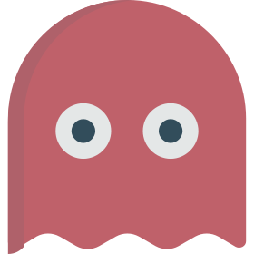  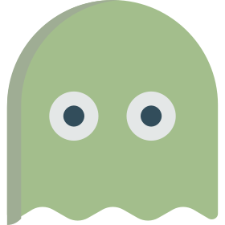 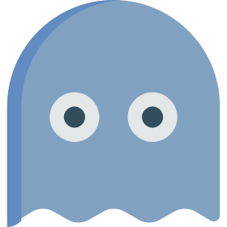

   

## 📝 Info

Program | Name
---|---
Window Manger | [i3-gaps](https://github.com/Airblader/i3)
Bar | [polybar](https://github.com/polybar/polybar)
Launcher | [rofi](https://github.com/davatorium/rofi)
Wallpaper Setter | [feh](https://feh.finalrewind.org/)
Web Browser | [firefox](https://www.mozilla.org/en-US/firefox/new/)
Icon Theme | [Papirus](https://github.com/PapirusDevelopmentTeam/papirus-icon-theme)
Gtk-theme | [Nordic-Gtk](https://www.gnome-look.org/p/1267246/)
Music Player | [Audacious-qt](https://audacious-media-player.org)
Music Visualizer | [xava](https://github.com/nikp123/xava)
Lockscreen | [i3lock-color](https://github.com/Raymo111/i3lock-color)
Terminal Emulator | [Alacritty](https://github.com/alacritty/alacritty)
Shell | [zsh](https://www.zsh.org)
Prompt | [starship](https://starship.rs)
Code Editor | [neovim](https://neovim.io), [vsocde](https://github.com/microsoft/vscode)
Notification daemon | [dunst](https://dunst-project.org/)
Fetch | [neofetch](https://github.com/dylanaraps/neofetch)
Login manager | [sddm](https://github.com/sddm/sddm)

## ⚙ Setup

Don't use the complete `i3` config, it contains many keybindings.
You can take parts of what you like.

- [Scripts](./Scripts)
- [dmenu-scripts](/Scripts/dmenu)
- [neofetch config](./.config/neofetch/config.conf)
- [starship config](./.config/starship.toml)
- [rofi scripts](./.config/rofi)
- [polybar config](./.config/polybar)
- [wallpaper](./screenshots/lighthouse.png)
- [sddm-theme](https://github.com/totoro-ghost/sddm-astronaut)

... and others.

If anything is missing open an issue 🛠.

### 🖥 Fonts used

- [feather](https://github.com/AT-UI/feather-font/tree/master/src/fonts)
- [Iosevka Nerd Font](https://github.com/ryanoasis/nerd-fonts/tree/master/patched-fonts/Iosevka)
- [VictorMono Nerd Font](https://github.com/ryanoasis/nerd-fonts/tree/master/patched-fonts/VictorMono)

## 📸 Screenshot 

|firefox|neofetch and neovim|
|-|-|
|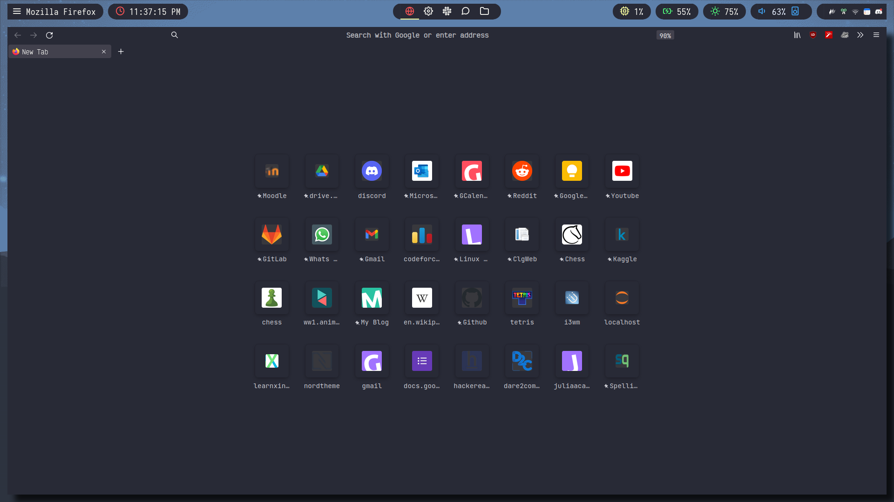|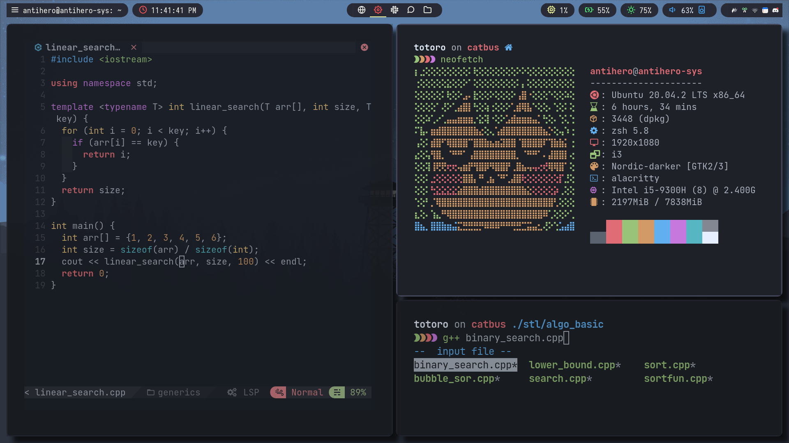|

|file manager & cat-notification|rofi-launcher|
|-|-|
|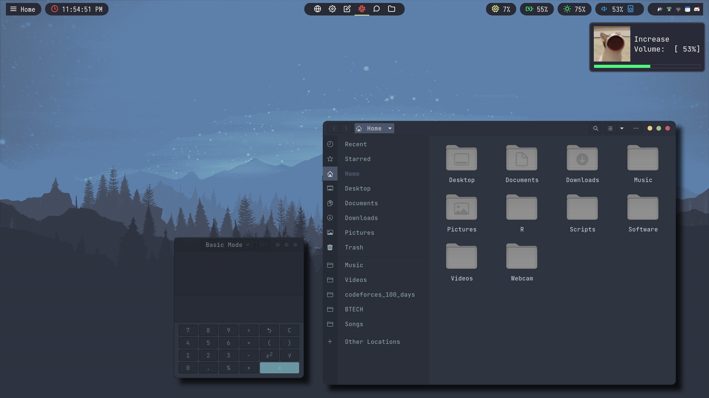|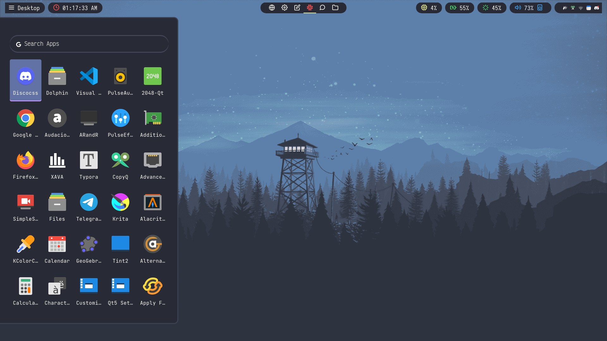|

|audacious & xava|vscode & rofi-notif|
|-|-|
|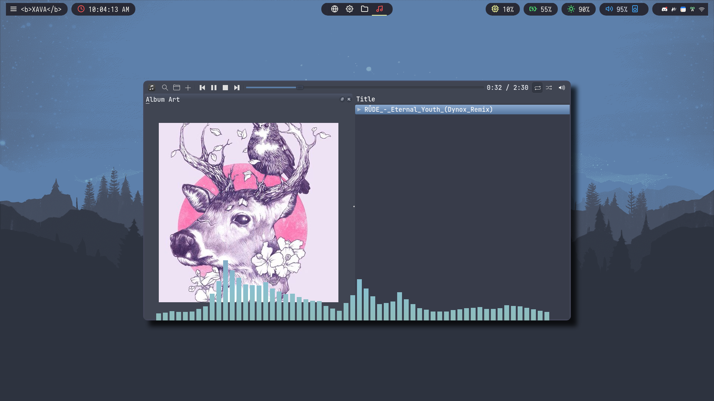|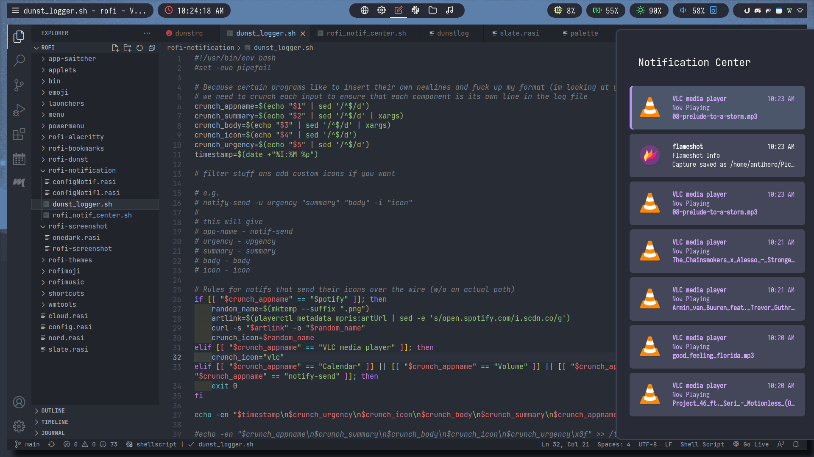|

|rofi-powermenu|rofi-window-switcher|
|-|-|
||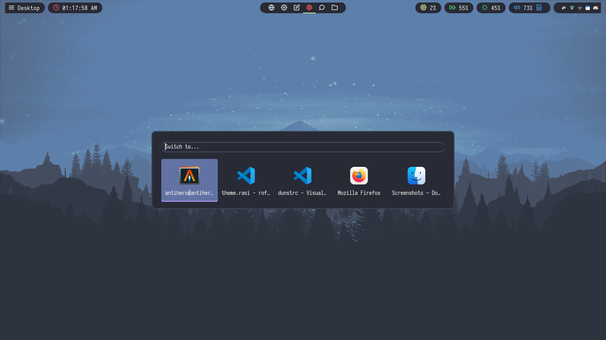|

|rofi-alacritty-conf|rofi-emoji|
|-|-|
|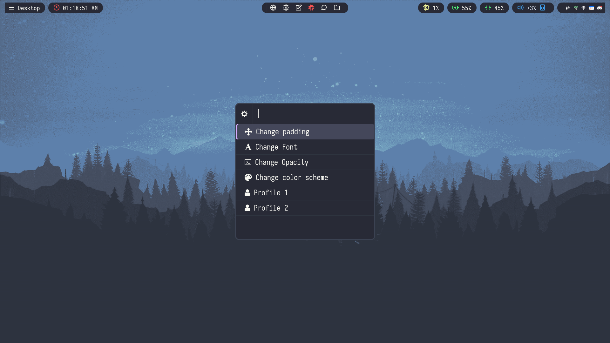|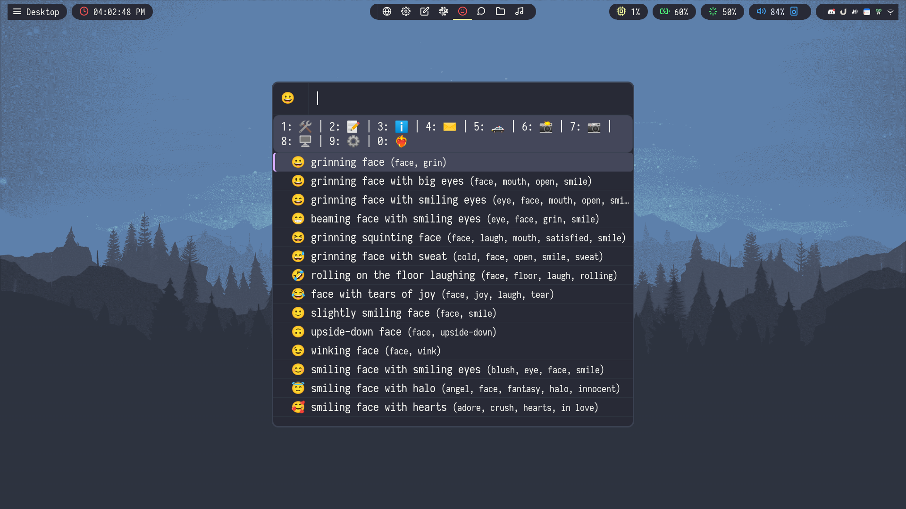|

|discocss|rofi-screenshot|
|-|-|
|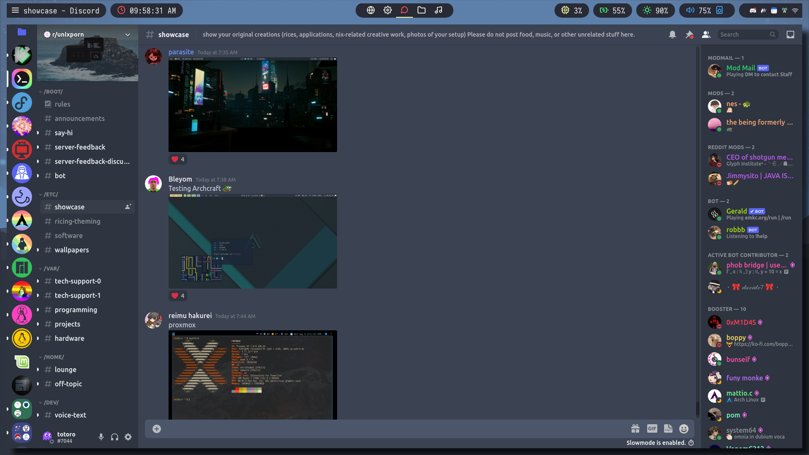|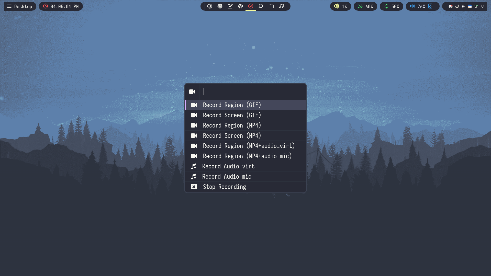|

|i3-lock|sddm-login-manager|
|-|-|
|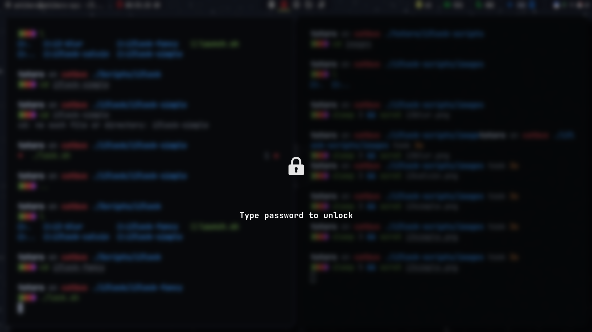|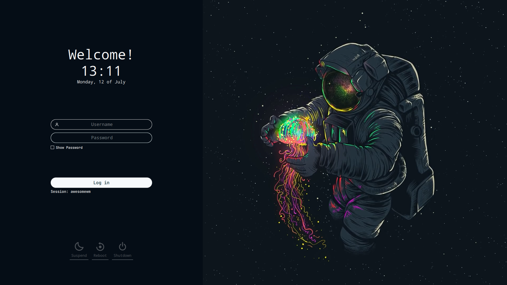|